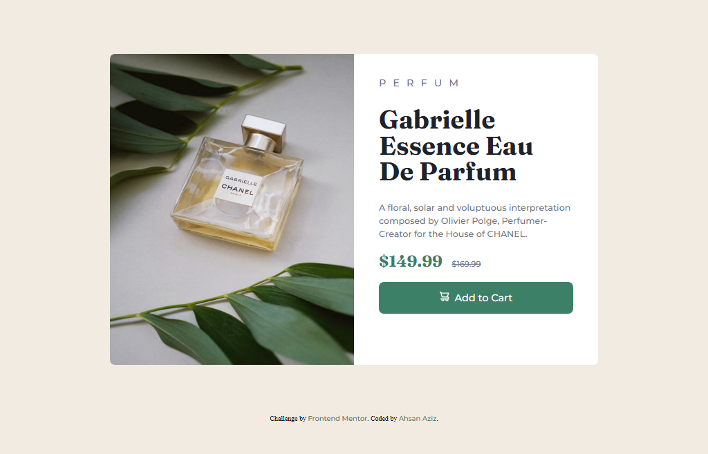

# Frontend Mentor - Product preview card component solution

This is a solution to the [Product preview card component challenge on Frontend Mentor](https://www.frontendmentor.io/challenges/product-preview-card-component-GO7UmttRfa). Frontend Mentor challenges help you improve your coding skills by building realistic projects.

## Table of contents

- [Overview](#overview)
  - [The challenge](#the-challenge)
  - [Screenshot](#screenshot)
  - [Links](#links)
- [My process](#my-process)
  - [Built with](#built-with)
  - [What I learned](#what-i-learned)
  - [Continued development](#continued-development)
  - [Useful resources](#useful-resources)
- [Author](#author)

## Overview

### The challenge

Users should be able to:

- View the optimal layout depending on their device's screen size
- See hover and focus states for interactive elements

### Screenshot

### Links

- Solution URL: [Add solution URL here](https://your-solution-url.com)
- Live Site URL: [Add live site URL here](https://your-live-site-url.com)

## My process

### Built with

- Semantic HTML5 markup
- CSS3 custom properties
- Mobile-first workflow

### What I learned

I learned how I design Responsive website and use @media query first-time.
For Mobiles devices
@media only screen and (max-width: 480px) {
  ...
}
For Tablets and iPads
  @media only screen and (min-width: 481px) and (max-width: 768px) {
  ...
}

### Continued development

I want to continue focusing on in future projects of HTML5 and CSS3 for responsive designs.

### Useful resources

- (https://www.w3schools.com/css/css_rwd_mediaqueries.asp) - This helped me for understanding responsive web design and media queries. I really liked this pattern and will use it going forward.

## Author

- Github - [Ahsan Aziz](https://github.com/AhsanAziz082)
- Frontend Mentor - [@AhsanAziz082](https://www.frontendmentor.io/profile/AhsanAziz082)
- Twitter - [@iamahsanaziz](https://www.twitter.com/iamahsanaziz)
